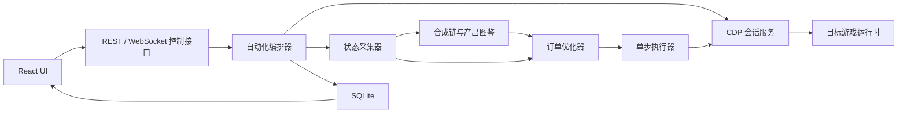
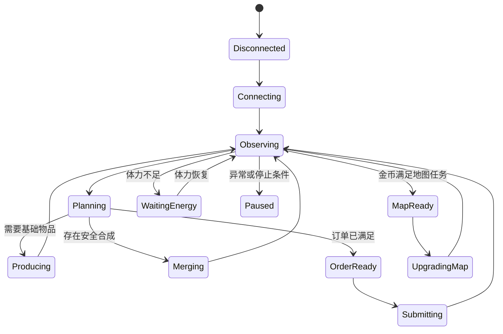

# 合成订单自动化桌面程序方案

## 1. 产品目标

把现有 CDP 实验项目升级为 Windows 桌面程序，形成以下闭环：

```text
读取棋盘与订单
→ 计算最优订单和体力成本
→ 点击正确的产出物
→ 合成并保护订单所需物品
→ 订单满足后提交
→ 累积金币
→ 金币足够后完成地图任务
→ 重新规划下一轮
```

程序提供三种模式：

1. **观察模式**：只读取和规划，不执行。
2. **辅助模式**：显示方案，用户确认后执行一轮。
3. **自动模式**：持续执行，遇到停止条件或异常后暂停。

## 2. 技术选型

推荐采用：

- **控制入口**：Node 托管的浏览器控制台
- **UI**：React + TypeScript + Vite
- **样式**：Tailwind CSS + 组件库
- **图表**：ECharts
- **后端**：保留当前 Node.js、CDP、WMPF 路线
- **本地数据库**：SQLite
- **通信**：REST 处理请求/响应，WebSocket 广播运行时事件；浏览器不直接连接 CDP

选择 Node 托管的浏览器控制台，是为了复用现有 `src/` 与 `wmpf/`，让自动化运行时独立于页面生命周期，并移除桌面安装包依赖。

## 3. 总体架构



### 进程边界

- Node 自动化运行时：CDP连接、状态机、规划、执行、数据库和控制接口。
- 浏览器控制台页面：交互与状态展示；页面关闭不终止自动化运行时。
- WMPF/CDP代理：可由 Node 运行时管理，也可通过 `npm run wx:cdp` 在外部终端启动。
- 游戏运行时：每次只执行一个短JS动作，不在 `Runtime.evaluate` 内运行长循环。

## 4. 核心模块

### 4.1 ConnectionService

职责：

- 启动和停止 WMPF/CDP 路线。
- 自动发现目标 execution context。
- context 销毁后重连。
- 心跳、超时和代理状态检测。
- 防止两个自动化任务同时控制棋盘。

### 4.2 GameStateCollector

统一输出：

```ts
interface GameState {
  scene: "map" | "board" | "warehouse" | "map-mission";
  resources: { coins: number; diamonds: number; energy: number };
  board: BoardGrid[];
  orders: OrderState[];
  producers: ProducerState[];
  warehouse: WarehouseState;
  mapMission: MapMissionState | null;
  overlays: string[];
}
```

所有规划和UI只读取这一层，不直接依赖混淆后的运行时字段。

### 4.3 ItemCatalog

保存：

- 合成链最低级和最高级。
- 每级物品ID、等级、下一等级ID和图标。
- `2 × n级 → 1 × n+1级`关系。
- 产出物等级、体力消耗和冷却。
- `CreateData`的产出概率。
- 数据来源、采集时间和置信度。

数据分为：

- `observed`：状态栏或运行时直接读取。
- `inferred`：根据连续等级规则推断。
- `unknown`：尚无足够数据。

### 4.4 OrderPlanner

#### 基础单位

等级 `n` 对应：

```text
baseUnits(n) = 2^(n-1)
```

#### 规划输入

- 所有订单目标物品。
- 当前棋盘和仓库库存。
- 已经为其他订单保留的物品。
- 当前体力。
- 产出概率和产出物冷却。
- 棋盘剩余空间。
- 订单金币奖励。

#### 目标函数

```text
score =
  金币奖励 / 期望体力
  + 接近完成度奖励
  - 棋盘空间压力
  - 冷却等待成本
  - 低置信度数据惩罚
```

UI允许切换策略：

- 最少体力。
- 最高金币/体力。
- 最快完成一个订单。
- 指定订单优先。

#### 滚动重规划

产出具有随机性，所以不一次性固定几十步。每次产出或合成后重新读取状态，再计算下一步。这比静态计划更可靠。

### 4.5 ActionExecutor

只提供原子动作：

- `selectGrid(index)`
- `clickProducer(index)`
- `merge(from, to)`
- `submitOrder(slot)`
- `openMapMission()`
- `completeMapMission()`
- `openWarehouse()`
- `moveToWarehouse(index)`

每个动作流程：

```text
动作前快照
→ 调用游戏原有触摸/拖拽处理器
→ 等待动画和状态同步
→ 动作后快照
→ 验证预期状态变化
```

不直接修改棋盘数据对象。

### 4.6 AutomationOrchestrator

状态机：



## 5. 自动化边界

必须具备以下保护：

- 订单精确等级物品进入保留集合，禁止继续向上合成。
- 产出物、稀有物品、限时物品默认锁定。
- 棋盘空格低于阈值时暂停产出，优先合成；没有可合成项时，将非订单保留、非产出物的可移动物品存入仓库以腾出空间。
- 自动模式不设动作步数上限；完成一个订单或体力降到 0 时结束本轮。
- 弹窗、引导、奖励动画存在时暂停动作。
- 单动作无状态变化时最多重试一次。
- execution context变化后废弃当前计划并重新采集。
- 每次 `Runtime.evaluate` 只执行一个动作，避免长循环超时后仍在游戏内继续运行。

## 6. UI 页面

### 6.1 总览页

- CDP连接状态。
- 当前模式和自动化状态。
- 金币、体力、钻石。
- 当前推荐订单。
- 预计体力、金币收益、地图任务缺口。
- 开始、暂停、停止、单步执行。

### 6.2 棋盘页

- 7×9可视化棋盘。
- 物品图片、等级和ID。
- 可合成物品高亮。
- 订单保留物品使用特殊边框。
- 产出物显示概率、剩余次数和冷却。
- 点击格子查看完整合成链。

### 6.3 订单页

- 每个订单的完成度。
- 缺少的物品和等级。
- 当前库存贡献。
- 预计产出次数和体力。
- 金币/体力效率排序。
- 手动指定优先订单。

### 6.4 图鉴页

- 按合成链展示1级到最高级。
- 产出物到合成链的关系图。
- 概率分布图。
- observed/inferred/unknown标记。
- 一键重新扫描状态栏快照。

### 6.5 地图任务页

- 当前地图任务和下一任务。
- 金币需求、当前金币和缺口。
- 预计还要完成多少订单。
- 金币足够时自动升级开关。

### 6.6 日志与回放页

- 每一步动作、原因和结果。
- 动作前后棋盘差异。
- 体力和金币曲线。
- 异常记录。
- 导出诊断包。

## 7. SQLite 数据结构

建议表：

- `merge_chains`
- `items`
- `producers`
- `producer_drops`
- `catalog_observations`
- `automation_sessions`
- `actions`
- `order_runs`
- `map_mission_runs`
- `settings`

图鉴数据与运行日志分离，便于更新图鉴但保留历史运行记录。

## 8. 开发阶段

### 阶段A：后端稳定化

- 把长循环改为Node侧单步编排。
- 抽象统一 `GameState`。
- 完成连接恢复、超时和动作验证。

验收：连续执行超过100个原子动作仍不产生重叠循环，并能在完成首个订单或体力归零时可靠停止。

### 阶段B：图鉴与规划器

- 图鉴持久化到SQLite。
- 完成所有可见合成链和产出概率采集。
- 实现订单保留、体力梯度和空间成本。

验收：规划结果能够解释“为什么选择这个订单和产出物”。

### 阶段C：订单闭环

- 自动产出、合成、停止于订单边界。
- 自动提交订单。
- 提交后识别新订单并重新规划。

验收：从未完成订单自动运行到金币到账。

### 阶段D：地图闭环

- 检测地图任务需求。
- 金币足够时完成任务。
- 读取下一地图任务并回到订单循环。

验收：订单金币累积和地图升级形成闭环。

### 阶段E：前端控制台

- 实现总览、棋盘、订单、图鉴、地图和日志页。
- 加入主题、动画和图表。
- 由 Node 控制服务托管构建产物，通过 REST 与 WebSocket 管理运行时。

## 9. 推荐目录结构

```text
web/
  src/
public/
src/
  automation-runtime.js
  control-server.js
packages/core/
  connection/
  collector/
  catalog/
  planner/
  executor/
  orchestrator/
packages/runtime-adapter/
packages/database/
packages/ui/
captures/
docs/
```

## 10. 第一实施批次

第一批不先做UI，先完成可靠闭环：

1. 将 `board:auto` 改为Node侧单动作循环。
2. 把当前图鉴和规划器迁入 `packages/core`。
3. 实现订单目标锁定和动态重规划。
4. 实现 `submitOrder`。
5. 实现地图任务完成动作。
6. 用CLI完成一轮“订单→金币→地图升级”验收。

CLI闭环稳定后再接前端控制台，避免界面掩盖底层自动化问题。
